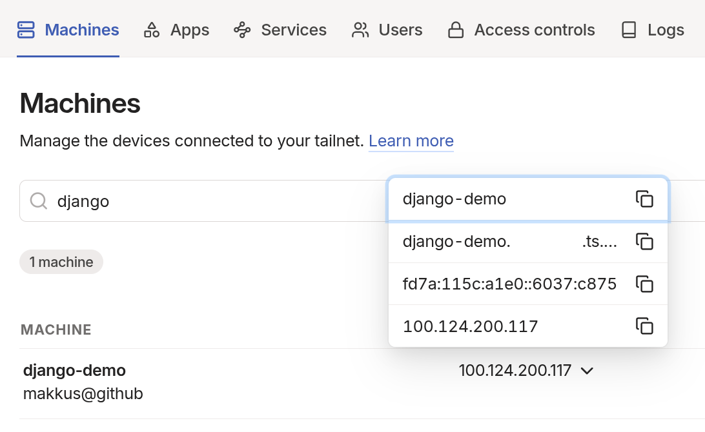
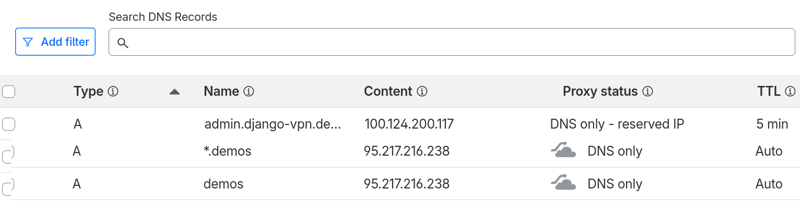

Private networks
----------------

- Class A: 10.0.0.0 to 10.255.255.255 
- Class B: 172.16.0.0 to 172.31.255.255 
- Class C: 192.168.0.0 to 192.168.255.255
- CGNAT (like tailscale VPN address space)
  - 100.64.0.0 to 100.127.255.255

<!-- end_slide -->

Tailscale
---------

<!-- column_layout: [3, 2] -->
<!-- column: 0 -->
- mesh VPN service
- built on top of WireGuard
- (super-)easy to set up (OpenVPN, anyone?)
- zero-trust networking
- open-source clients
- self-hosting of control plane possible
- works on Linux, macOS, Windows, iOS, Android
- low overhead
- share single hosts with other Tailscale users
<!-- column: 1 -->

<!-- reset_layout -->
<!-- end_slide -->

https certificates (using Let's Encrypt)
------------------

- supported natively by modern reverse proxies (Caddy, Traefik, ...)
- **http challenge**:
  - requires web server, Let's Encrypt client accesses file at.well-known/acme-challenge/ as proof of ownership
- **DNS challenge**:
  - requires DNS provider API access, Let's Encrypt requests DNS record update as proof of ownership

- this works easiest with **DNS challenge**

<!-- end_slide -->

DNS configuration
-----------------

- create API token from your DNS provider (e.g. Cloudflare)
- set up DNS records for your domain:
  - `[PRIVATE_SUBDOMAIN].<your-domain>` -> private VPN IP address (e.g. Tailscale IP)
  - `[PUBLIC_SUBDOMAIN].<your-domain>` -> public IP address



<!-- end_slide -->

Django configuration
--------------------

- add `django-hosts` to project dependencies
- configure `django-hosts`: INSTALLED_APPS, MIDDLEWARE, ROOT_HOSTCONF, DEFAULT_HOST
- create `hosts.py` file (next to root `urls.py`)

```python
from django.conf import settings
from django_hosts import patterns, host

host_patterns = patterns('',
    host(r'admin', 'django_vpn_demo.admin_urls', name='admin'),
    host(r'(\w+)', settings.ROOT_URLCONF, name='public'),
)
```
<!-- end_slide -->

Win!
----

<!-- column_layout: [4, 5] -->
<!-- column: 0 -->
Public 
 https://django-vpn.demos.frkl.dev/
<!-- column: 1 -->
Private

 https://admin.django-vpn.demos.frkl.dev/
<!-- reset_layout -->

<!-- end_slide -->

Demo code
---------

- https://github.com/makkus/django-vpn-demo


